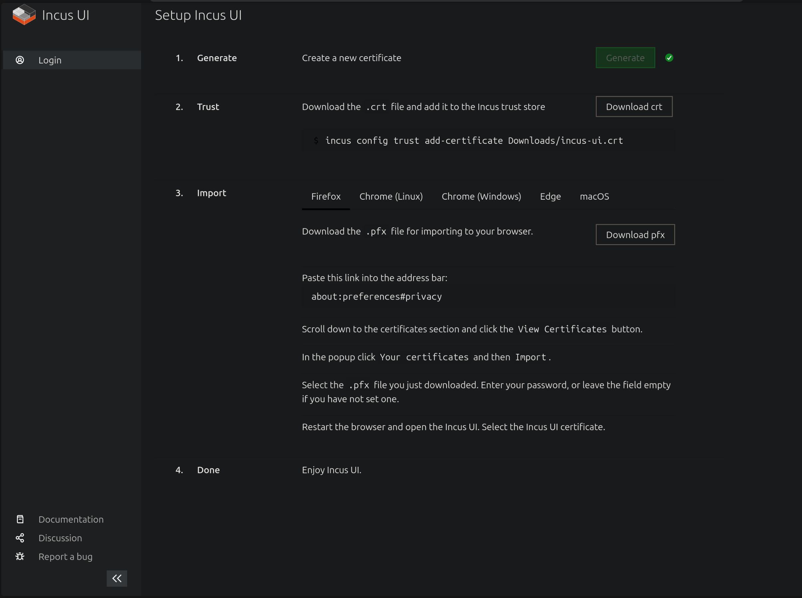
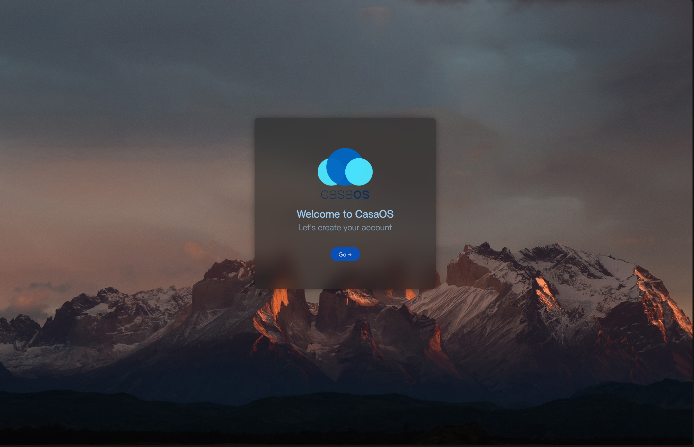

In this post, I'll be setting up my Debian server with Docker and even setting up ability to create and manage Virtual Machines and Linux Containers.

### Configuring the network
I'll need to modify the `/etc/network/interfaces` file to the following.

```text
# This file describes the network interfaces available on your system
# and how to activate them. For more information, see interfaces(5).

source /etc/network/interfaces.d/*

# The loopback network interface
auto lo
iface lo inet loopback

# Wifi
auto wlp3s0
iface wlp3s0 inet manual

# The primary network interface
allow-hotplug enp4s0
iface enp4s0 inet static
        address 192.168.1.100/24
        gateway 192.168.1.1
```

This turns off the Wifi and sets a static address to the ethernet connection. Now reboot the machine.

### Incus
Since I did not install Proxmox, what if I want an easy to use WebGUI for creating and maintaining VMs and LXCs? Introducing Incus. It is a community driven alternative to Canonical's LXD, an all-in-one solution for creating and maintaining Virtual Machines and LXCs. This gives us a nice WebUI similar to Proxmox without the extra features I might not use.

I'll be using the incus builds provided by [Zabbly](https://github.com/zabbly/incus) as they provide builds for Debian 12 as well as a WebUI, which is a fork of Canonical's LXD WebUI. Switch to being a root user.

```bash
sudo su
```

Now run the following commands as a root user.

```bash
wget -q -O - https://pkgs.zabbly.com/key.asc | gpg --show-keys --fingerprint 
# Output should contain fingerprint matching the fingerprint on the github page's instructions

mkdir -p /etc/apt/keyrings/
wget -O /etc/apt/keyrings/zabbly.asc https://pkgs.zabbly.com/key.asc
```

I'll be installing the 6.0 LTS version.

```bash
sh -c 'cat <<EOF > /etc/apt/sources.list.d/zabbly-incus-lts-6.0.sources
Enabled: yes
Types: deb
URIs: https://pkgs.zabbly.com/incus/lts-6.0
Suites: $(. /etc/os-release && echo ${VERSION_CODENAME})
Components: main
Architectures: $(dpkg --print-architecture)
Signed-By: /etc/apt/keyrings/zabbly.asc

EOF'
```

Now install the incus and GUI packages.

```bash
apt update
apt install incus incus-ui-canonical -y
incus admin init
```

You'll be presented with a bunch of options to setup the incus admin. Just press Enter to choose the default in all of them, except in the question, "Would you like the server to be available over the network?", in which choose yes. Now navigate to https://&lt;server-ip-address&gt;:8443 and you'll need to generate certificate to access the WebUI. 

Click the "Create a new certificate" button. On the next page, click Generate to generate a certificate. Optionally add a password as well. Download the .crt file and send it to your server via scp, then run this command on the server.

```bash
incus config trust add-certificate incus-ui.crt
```

Now back in the web interface, download the pfx file and follow the instructions to add it to your browser.



After restarting the browser, when you revisit the address, it'll prompt you to select the certificate you added in the previous step. After that, you should have a web interface ready to create and manage VMs and LXCs.

Also exit out of the root user with the following command.

```bash
exit
```

### Docker
To setup all my services that will run on my home server, I'll be using [Docker](https://docs.docker.com/engine/). However, instead of installing it manually, I'll be making use of [CasaOS](https://casaos.zimaspace.com/). There are a number of benefits of maintaining Docker containers through CasaOS, such as:

* One click installation of apps. No need to fiddle around with Portainer or Docker compose files.
* Ability to format our SSD for storage and setup a Samba share with the click of a button.
* A nice dashboard to access all our apps so no need to install a separate dashboard.

However, in a production environment, you should definitely use Docker compose files as they provide reproducibility which you don't get with CasaOS or with Docker CLI commands.

To install CasaOS, simply run the following command.

```bash
curl -fsSL https://get.casaos.io | sudo bash
```

That's it. It's as easy as that. After installation, you can visit http://&lt;server-ip-address&gt; and you'll be presented with the CasaOS UI.



### Next steps
Now that my server is up and running, I'll be finally installing the needed apps for my home server in the next post.