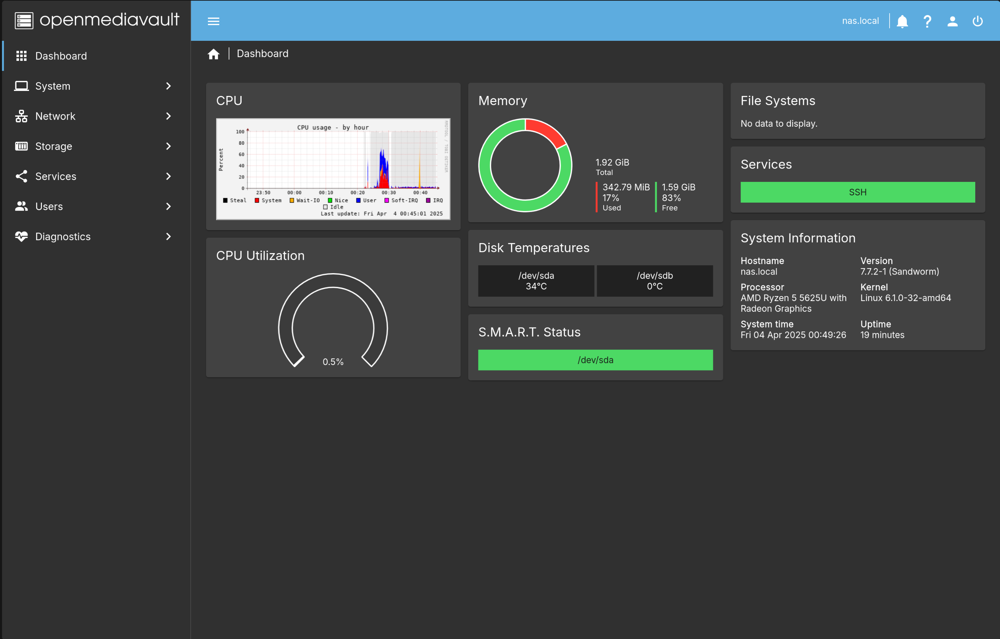
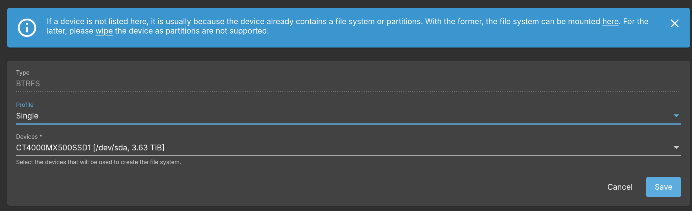
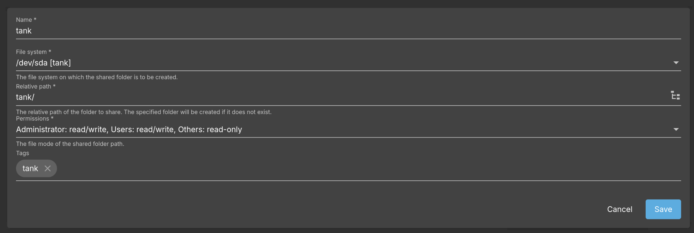
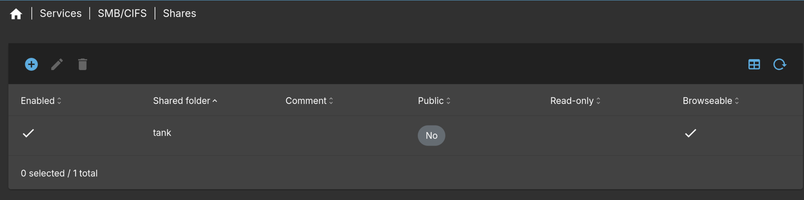
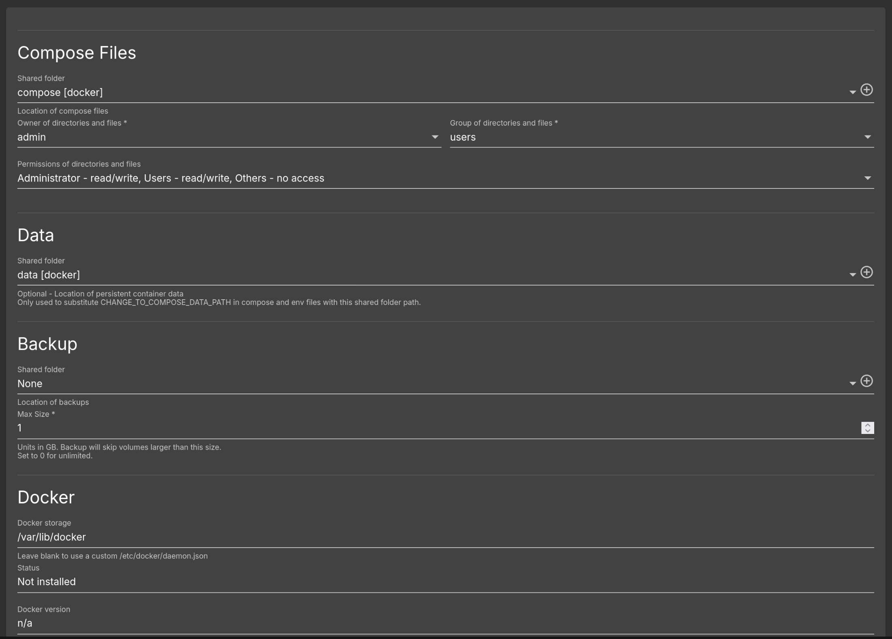
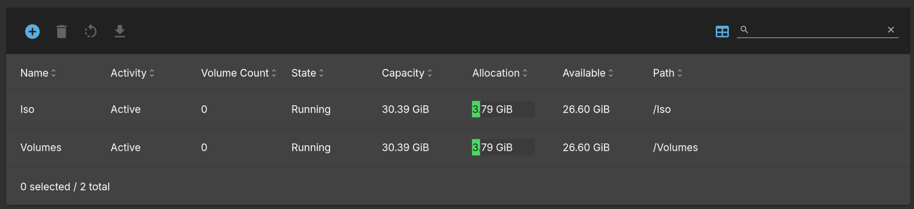

In this post, I'll be setting up a home server with OpenMediaVault (OMV) with the ability to run Docker containers, Linux containers (LXCs) and Virtual Machines (VMs). It will also function as a NAS. I'm using a Ryzen mini PC with 1 nvme SSD and 1 SATA SSD.

### Initial Setup
After installing OMV, on the console itself, run `omv-firstaid` command to open the OMV firstaid utility. This gives an easy to access UI for changing some important settings. Change your network configuration and dashboard password from here and then reboot.

After rebooting, open the link given in the terminal prompt, `http://<ip-address>`. This opens the dashboard. Login with `username: admin` and password whatever you set with the firstaid utility. If the password was not changed, the default password is `openmediavault`.

Go to Storage > S.M.A.R.T. > Settings and enable the service. Then go to Devices in the same menu, select your disks, and then press the edit button on the top. In the edit dialog, check "Monitoring enabled" and press Save.

OMV will prompt you to confirm the changes. It does this every time there is a change to the underlying configurations. So this needs to be done every time we make any changes.

Now back on your dashboard, click on User Settings in the top right hand corner and select Dashboard from the drop down menu. Choose all the items you wish to see on your dashboard and press Save.



Also, head over to Users > Users and Create a new user if you don't have a local non root user. 
> If you already have a local user and you want to use it for SMB, select the user and press edit. You'll need to enter your password again (in the change password fields) since SMB cannot retrieve your password details from the UNIX user. Also make sure the user is part of the users group.
{: .prompt-warning}

### NAS
Now we setup the Network Storage. Since OMV is built for this functionality, this is a pretty straightforward process.

Head to Storage > Disks. Select your device where you want to store data and press Wipe from the top menu. Select Quick method for fast wiping.
> Be careful which drive you wipe as it will erase all the previous data.
{: .prompt-danger}

Next go to File Systems and press Create and mount a file system from the top menu. Choose Btrfs for many features including snapshots. Select desired RAID configurations. Since I have a single SATA drive, I just selected Single disk.
> You can also instead opt for ZFS. In the next section, when we install omv-extras, install the ZFS and [kernel](https://wiki.omv-extras.org/doku.php?id=omv6:omv6_plugins:kernel) plugins. In the kernel plugin, install the latest stable proxmox kernel (has better ZFS support than the kernel shipping with Debian at this time) and reboot. Then setup the ZFS pools. You can also setup [automatic snapshots](https://wiki.omv-extras.org/doku.php?id=misc_docs:auto_zfs_snapshots).
{: .prompt-info}



Next head over to Shared Folders, and create a new share.



Next, head over to Services > SMB/CIFS > Settings and check Enabled. Change any settings or just leave them as default and press Save. Then in Shares, create a new share with the shared folder we created in the last step.



Now the SMB share should be live and can be browsed from any major operating system.

### OMV-Extras
Most of OMV plugins are available after installing the omv-extras package. Install it with the following command as root.

```bash
wget -O - https://github.com/OpenMediaVault-Plugin-Developers/packages/raw/master/install | bash
```

This makes a lot more plugins available at System > Plugins. One such plugin is openmediavault-zfs which allows you to create ZFS pools on your disks instead of the standard filesystems that OMV provides. In the current OMV version (version 7), you'll also need to install openmediavault-kernel plugin and install the Proxmox kernel (6.8 stable version at this time) which has much better support for ZFS.

Other recommended plugins are:

* openmediavault-sharerootfs: Allows you to create file systems on the boot drive.
* openmediavault-flashmemeory: Reduces the number of writes on the system. Prolongs the life of Flash memory devices such as SSDs. It also enables installation of OMV on thumb drives and SD cards.

### Docker
To enable docker, go to System > omv-extras and enable flash storage the openmediavault-compose plugin.

First, we'll need to create some folders for the compose plugin. Open Storage > Shared Folders. Here, we'll create 2 new folders called "Compose" and "Data" and optionally a 3rd "Backups" folder.

Next head over to Services > Compose > Settings and then in each of the section, assign the folder we just created.



At the bottom, press Save, and then "Reinstall Docker".

Now docker should be up and running. To create a new container, head on over to Files, and click on Add > Add to create a new docker compose file, or choose Add from example to browse templates you can use.
> In the compose file, you can place the string "CHANGE_TO_COMPOSE_DATA_PATH" in the volumes path configuration. OMV will replace this string with path to your data directory you defined in the settings. For example, CHANGE_TO_COMPOSE_DATA_PATH/adguard/work:/opt/adguardhome/work
{: .prompt-info}

### Virtualization
OMV also supports creation of Virtual Machines and Linux Containers from the openmediavault-kvm plugin. You'll also need the openmediavault-sharerootfs plugin to create the VM and LXC data on the boot drive.

First, you'll need to enable backports repo from System > omv-extras. Then install the plugins.

Now you'll need to create two new shared folders called "Volumes" and "Iso", then head on over to Services > KVM > Pools. Here, create two new directories called Volumes and Iso and link them to the shared folders you created. Click on the State button on the top, and press Start on both of them.



You'll also need to create a new network configuration. Go to Networks, press the + button on top, and select "Add macvtap network". Name it Bridge, and link it to your network interface in the second field. After creating, activate it from the top menu.

Now you can upload your Iso images in the Iso folder and create VMs from the VMs menu option. OMV has a built in VNC viewer for having a virtual screen for your VM.

To create LXCs, you can press the add new container button on the VMs page, and create an LXC container. To access the LXC, type the following command in the terminal. (Replace lxc_name with the name of LXC)

```bash
sudo virsh -c lxc:/// console lxc_name
```

This will connect you to the LXC console. The default login is `user: root, password: openmediavault`. To disconnect from it and return to the OMV host, press `Ctrl + ]`

> The OMV KVM plugin also runs a dnsmasq service on port 53, making it hard to run your own services such as pihole or adguard. So it is recommended to run these services in an LXC instead of Docker.
{: .prompt-warning}