In this post, I'll be setting up a home server with Proxmox. It will also function as a NAS. I'm using a Ryzen mini PC with 1 nvme SSD and 1 SATA SSD.

Proxmox is a type 1 hypervisor platform and my favorite OS for a homelab as it makes it so easy to experiment around with different Operating Systems and configurations without having to reinstall the host Operating System.

### Initial Setup
I installed proxmox with a RAID0 ZFS on the NVMe drive and then opened up the dashboard after completing the installation.

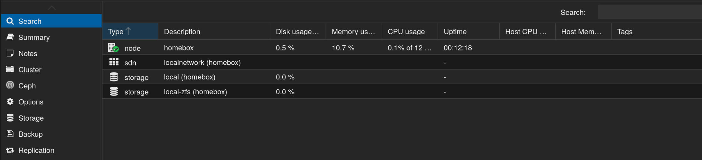

After that, we'll need to enable the updates. Skip this step if you have an enterprise subscription of proxmox. Click on your node in the left most menu, then in the menu right of it, head to Updates > Repositories. Disable the ceph and pve enterprise repositories, and then click Add on the top. From the Repository drop down, select No-Subscription, and click add.

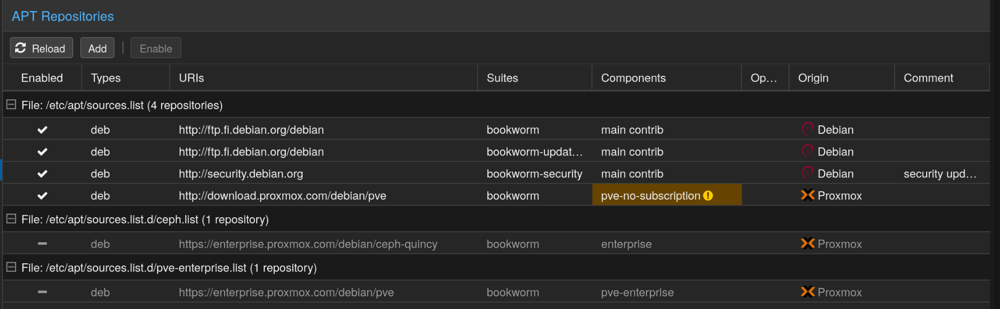

Then click on Updates, click on refresh and it should list all the updates. Click Upgrade to upgrade Proxmox and reboot if necessary.

### Plan
So this is how I'm planning to set up this server. I've changed my router's DHCP to not assign new devices addresses 192.168.1.100 and above. My plan is to match the IP address of the VM/Container to its ID. For example an LXC with ID 100 = 192.168.1.100 and a VM with ID 200 = 192.168.1.200.

As for my services, I'm planning to create small services that don't require access to my SSD in an LXC container. Then I'll pass my SATA PCI controller directly to a TrueNAS Scale VM and set up a NAS with SMB and NFS shares. Then I'll create several VMs with services running in docker and mount the NFS share onto that machine.

#### Why pass SSD to a dedicated VM?
Proxmox lacks native support for creating network shares, and it is considered a bad practice to modify a type-1 hypervisor directly. Another bad practice is using privileged containers as it can compromise security.

You can setup an unprivileged container, run Cockpit or Turnkey-fileserver on it, then [bind mount the SSD](https://pve.proxmox.com/wiki/Unprivileged_LXC_containers) onto these containers, but it is a pain to setup all the permissions and then modify each containers configuration to allow users of specific group to edit the file. Not to mention, you cannot run NFS service in an unprivileged container in the first place.

Since we have lots of resources, we can make use of dedicated VMs and save ourselves massive headaches.

#### Why TrueNAS Scale?
TrueNAS scale has ZFS support out of the box and lots of very useful features for our convenience. As a downside, we do need to dedicate a significant amount of system RAM to this VM, but think of it like this, we're dedicating X amount of RAM for caching our data, which ZFS does best.

#### Why multiple VMs for Docker?
I decided to split the services into their own VMs running Docker just to have a separation of concerns. I chose VMs instead of LXC just so I can mount NFS share onto it. I plan to manage them all from a single portainer install in an LXC.

### Setup
I'll be using Debian for all my VMs and LXCs unless I have specific need for any other distribution. For example, I could use Ubuntu if some software is only available as a snap package, or I could run AlmaLinux if I want to work with any of the RedHat software such as Podman.

In every Debian install, I first update the system, then install unattended-upgrades with the following command.

```bash
apt install -y unattended-upgrades
```

In LXCs, I create a non-root user if needed. For example, it's better to install a non-root user for dealing with docker.

### TrueNas Scale
For the TrueNAS Scale VM, I chose these settings.

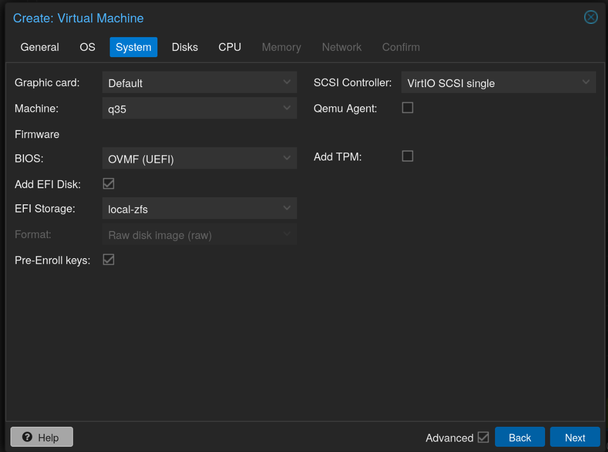

> Note that if we choose OVMF machine, we will need to disable secure boot in the VM to run the TrueNAS installer. When the VM starts, press escape key and it should open the UEFI settings. Go to Device Manager > Secure Boot Configuration and disable Attempt Secure Boot. Then press F10 to save and Continue.
{: .prompt-warning}

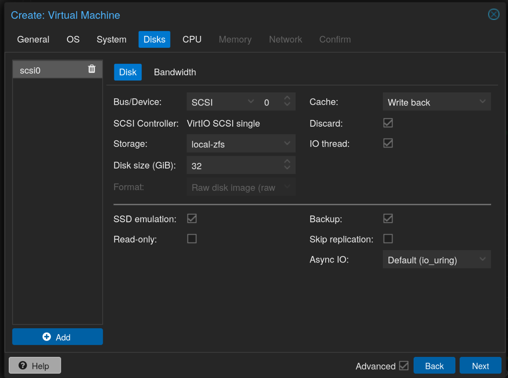
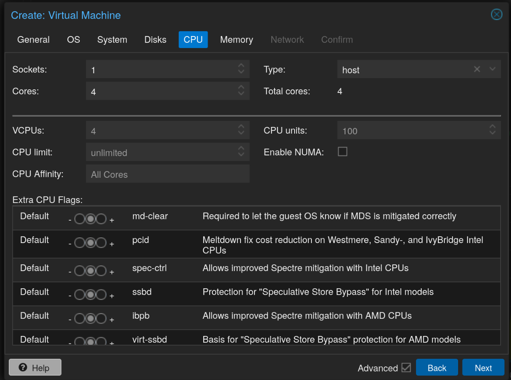
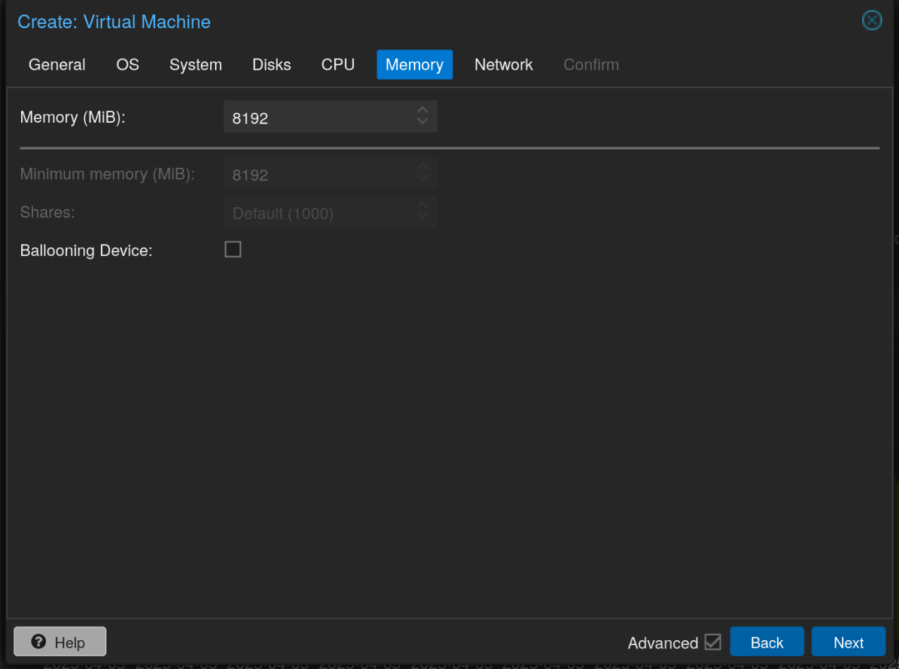

I'm providing 8 GB of non ballooning RAM to TrueNAS as I only intend to use it as a NAS and run no extra services, not use deduplication, etc.

For passing the PCI SATA controller, first we need to identify the device. Run the following command in the proxmox terminal.

```bash
ls -al /sys/block/sd*
```

For me, the output was the following, and the device I was looking for was 0000:06:00.1 which I added to the TrueNAS scale VM by clicking on the VM, going to Hardware, clicking Add > PCI Device.

```bash
lrwxrwxrwx 1 root root 0 Apr  5 21:58 /sys/block/sda -> ../devices/pci0000:00/0000:00:08.2/0000:06:00.1/ata2/host1/target1:0:0/1:0:0:0/block/sda
```

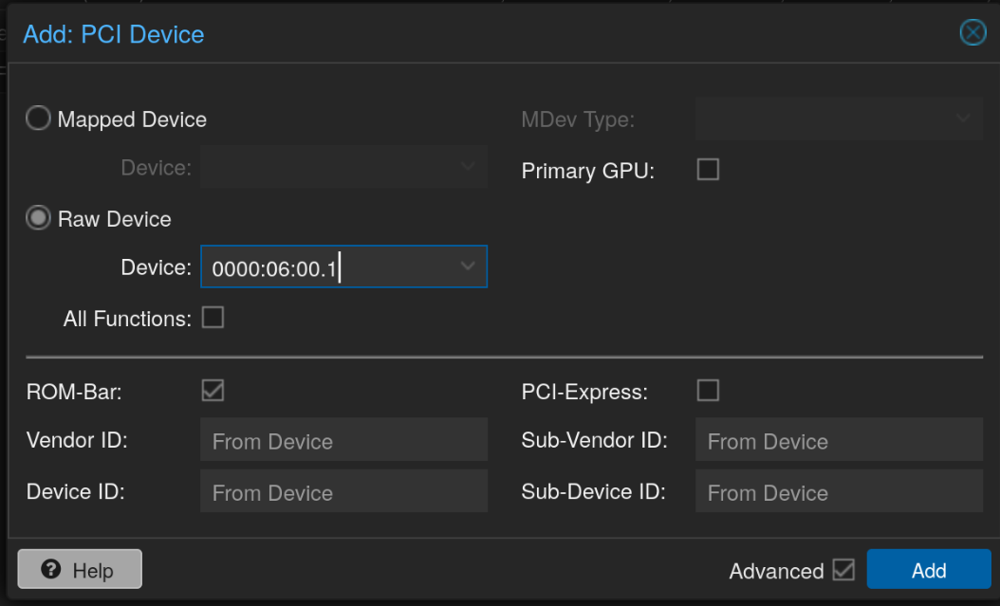

After installing TrueNAS Scale, I created a new encrypted Stripe pool with my SSD and then created a few datasets.

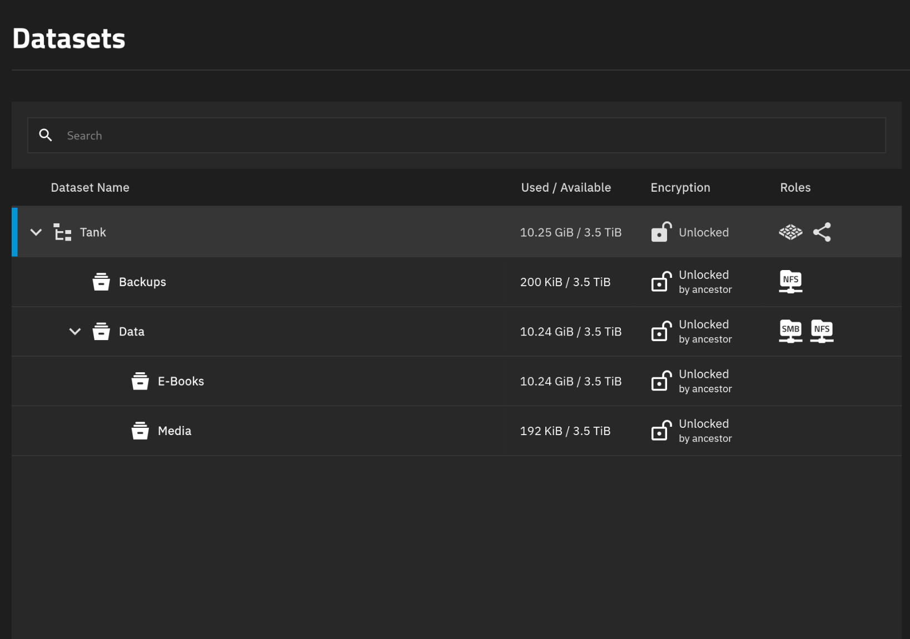

Then created a new user with ID 1000 as this is how we'll be mounting the NFS share in the VMs. Make this a SMB user as well. Changed the ACLs on the Data dataset to the new user and kept the Backups to root since we'll be using that proxmox backups. After that I created SMB and NFS shares.

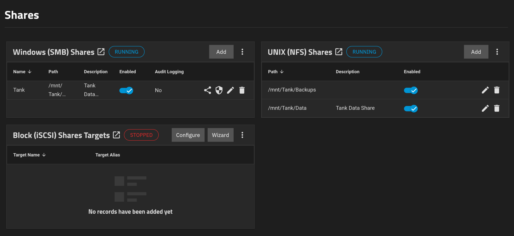

> By default the Backups share will give a permission denied in Proxmox and also in Docker volume mounts. To fix this, edit both of the shares, select Advanced options and change the Maproot User and Maproot Group to root.
{: .prompt-danger}

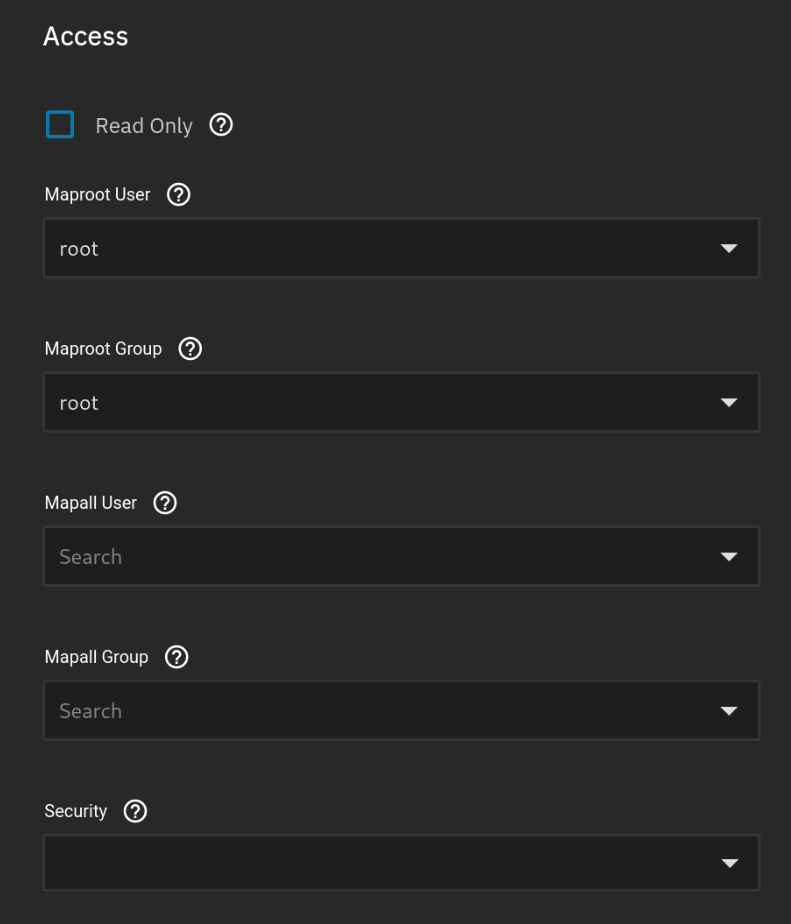

After that in Proxmox, you can go to Datacenter > Storage and then click on Add > NFS and enter the details.

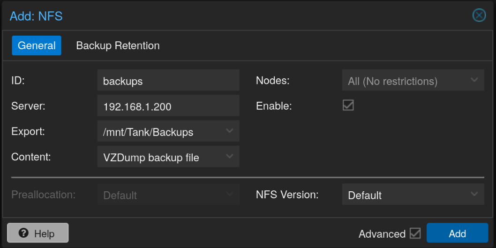

Then finally, create a new Backup job from Datacenter > Backup and click Add.

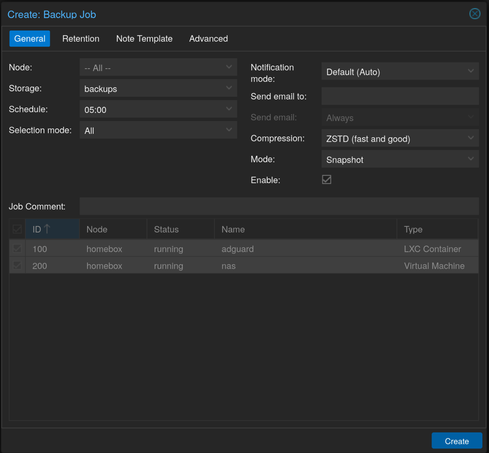

Lastly, I also created some periodic snapshots and SMART tests.

### Docker VM
For the docker services, I created separate Debian VMs and installed docker and added the local user to the docker group.

```bash
curl -fsSL https://get.docker.com | sudo bash
sudo usermod -aG docker user
```

After logging out and logging back in, my local user would have the ability to run docker commands without sudo. Then I also installed cockpit as that would allow me to manage this server via a central cockpit console. Be sure to replace "bookworm" with the current version of debian.

```bash
sudo su

echo "deb http://deb.debian.org/debian bookworm-backports main" > /etc/apt/sources.list.d/backports.list

apt update
apt install -t bookworm-backports cockpit
exit
```

Now the reason I opted for VMs instead of LXCs was the easy mounting of NFS shares. So to do that, I installed autofs which allows easy automatic mounting and unmounting of NFS shares.

```bash
sudo apt install nfs-common autofs
```

Next configure the autofs in `/etc/auto.master`. Add the following at the end of the file.

```text
/mnt /etc/auto.nfs --ghost --timeout=60
```

Next edit the `/etc/auto.nfs` file and add the following. Add the IP address of the NFS server.

```text
tank -fstype=nfs4,rw,uid=1000,gid=1000 <ip address>:/mnt/Tank/Data
```

This should mount the NFS share in /mnt/tank for 60 seconds every time any program tries to access it.

### Central Management Server
I decided to create a Debian LXC for this and install Docker and Cockpit using the same commands shown in the previous section. 

Then in cockpit, click on the top left cornet which shows user@host and select Add new host. Enter your IP address in the field and leave the user blank if using the same UID, otherwise enter the username. This creates a SSH connection to the other server.

After that, I installed Portainer.

```bash
docker volume create portainer_data

docker run -d -p 8000:8000 -p 9443:9443 --name portainer --restart=always -v /var/run/docker.sock:/var/run/docker.sock -v portainer_data:/data portainer/portainer-ce:lts
```

Opening up the WebUI, on the left menu, select Environment-related > Environments. There should be a local environment. Select Add environment, and then select Docker Standalone on the next screen and click Start Wizard.

On the next screen, make sure Agent is selected. It will give you a command below. Copy that and paste it in the VM where docker is already installed. After the container is running, get back here and give the environment a name and then the IP address of the server where the agent was just installed like: `192.168.1.201:9001`.

Repeat all the above process for every server to have a central location for managing all the servers and docker environments.